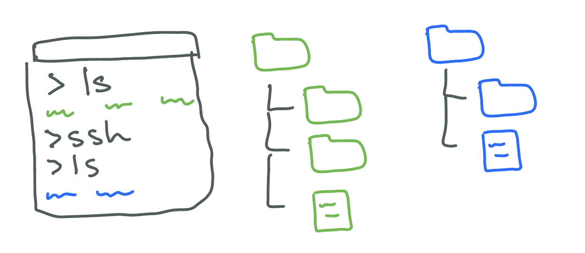

# UCSD CSE29 FA24 Syllabus and Logistics

- [Aaron Schulman](https://cseweb.ucsd.edu/~schulman/) (Instructor)
- [Joe Gibbs Politz](https://jpolitz.github.io) (Instructor)

[Basics](#basics) -
[Schedule](#schedule) -
[Course Components](#syllabus) -
[Staff &amp; Resources](#staff-resources) -
[Grading](#grading) -
[Policies](#policy)

CSE 29 introduces you to the broad field of systems programming, including 1) the basics of how programs execute on a computer, 2) programming in C with direct access to memory and system calls, 3) software tools to manage and interact with code and programs. All very cool stuff that makes every programmer better!

##  Basics

- Lecture (attend the one you're enrolled in):
    - Joe/A section: 10am [Catalyst Lecture Hall](https://map.concept3d.com/?id=1005#!m/576554?share) 0125
    - Aaron/B section: 12pm (noon) [Solis Lecture Hall](https://map.concept3d.com/?id=1005#!m/237105?share) 104
- Discussions (attend either):
    - Wed 8am [Warren Lecture Hall](https://map.concept3d.com/?id=1005#!m/246292?share) 2001
    - Fri 4pm [Solis Lecture Hall](https://map.concept3d.com/?id=1005#!m/237105?share) 104
- Labs: Tuesdays (check your schedule!). Either B260 or B270 in the [CSE building](https://map.concept3d.com/?id=1005#!m/164780?share)
- Exams: [AP&M B349](https://map.concept3d.com/?id=1005#!m/167186?share), flexible scheduling in weeks 3, 5, and 8
- Final exam: [AP&M B349](https://map.concept3d.com/?id=1005#!m/167186?share), flexible scheduling in week 10
- Professor office hours – Joe and Aaron each have 2 hours. Come to either and
ask anything you need. Overall, the afternoon times are only for CSE29
questions, and the morning times are for general advising and may have non-CSE29
students present as well.
    - Aaron:
        - Tuesday 10-11am (prioritizes CSE29, CSE lab B250)
        - Tuesday 3-4pm (prioritizes general advising, CSE office #3120)
    - Joe:
        - Tuesday 9-10am (prioritizes general advising, CSE office #3206)
        - Tuesday 1-2pm (prioritizes CSE29, CSE lab B250)

- Podcasts: [podcast.ucsd.edu](https://podcast.ucsd.edu)
- Q&A forum: [Piazza](https://piazza.com/ucsd/fall2024/cse29/home)
- Gradescope: [https://www.gradescope.com](https://www.gradescope.com)
- Textbook/readings: [Dive Into Systems](https://diveintosystems.org/book/), plus additional readings we will assign (all free/online)
  - Free: [MIT Missing Semester](https://missing.csail.mit.edu/)
  - Not free but pretty cheap: [Julia Evans Zines](https://wizardzines.com/), especially [The Pocket Guide to Debugging](https://wizardzines.com/zines/debugging-guide/)

##  Schedule

The schedule below outlines topics, due dates, and links to assignments. We'll
typically update the material for the upcoming week before Monday's lecture so
you can see what's coming.

### Week 1 – Strings, Memory and Bitwise Representations (in C)

### Week 0 – Welcome!

- **Resources**
    - [Repository for today](https://github.com/ucsd-cse29/fa24-01-w1f-hello)

- **Announcements**:
    - Lab attendance is **required** and a lot happens there, make sure to go to lab
    - Submit the [welcome survey](https://docs.google.com/forms/d/e/1FAIpQLSeJknloDw6HVo7j7FFWt8_i2HqzeOhzgaPyJ3z7GJrDVCwCuw/viewform) before lab on Tuesday of week 1
    - Assignments, quizzes, and other things with deadlines will start in week 1
    - No discussion on Friday of week 0 (discussion starts in week 1)

##  Staff Resources

### Office Hours Calendar

<iframe src="https://calendar.google.com/calendar/embed?src=c_b354a60fd90d70b416c5ebd8a4c1997692dcad6b9ad42806997478e11386eb3d%40group.calendar.google.com&ctz=America%2FLos_Angeles" style="border:solid 1px #777" width="800" height="600" frameborder="0" scrolling="no"></iframe>

## Syllabus

There are several components to the course:

- **Lab sessions**
- **Lecture and discussion sessions**
- **Weekly quizzes**
- **Assignments**
- **Exams**

### Labs

The course's lab component meets for 2 hours. In each lab you'll switch between
working on your own, working in pairs, and participating in group discussions
about your approach, lessons learned, programming problems, and so on.

The lab sessions and groups will be led by TAs and tutors, who will note your
participation in these discussions for credit. Note that you must
**participate**, not merely **attend**, for credit.

If you miss lab, you'll still be held accountable for understanding the
relevant material via Skill Demonstrations and Lab Reports. You can miss 2 labs
without it impacting your grade (see [Grading](#grading) below). There is no
way to make up a lab, even for illness, travel, or emergencies. Our preference
would be to require all 10 labs for an A, and have some kind of excused
absences. However, tracking excused absences doesn't really scale, so the “two
for any reason” policy is how we handle it. You don't need to justify your
missed labs. Contact the instructor if you'll miss more than 2 labs for
unavoidable reasons.

### Lecture and Discussion Sessions

Lecture sessions are on Monday, Wednesday, and Friday, and discussion sections
are Wednesday and Friday. We recommend attending every lecture and one of the
two discussion sections.

### Weekly Quizzes

Each week there will be a (p)review quiz given on Gradescope or PrairieLearn to
both review content you've seen and preview upcoming content, due before labs
start on Tuesday at 8am.

You can submit these repeatedly with no penalty up to the deadline. The purpose
of this quiz is to make sure everyone has checked in on the concepts we will be
using in lab. They are open for late submission until the end of the quarter;
see [Grading](#grading) below for how late submissions impact grades.

### Assignments

The course has 5 **assignments** that involve programming and writing.
Individual assignments will have detailed information about submission
components; in general you'll submit some code and some written work to
Gradescope. Two files will have special meaning in this class: in `CREDITS.txt`
you'll put information about who or what helped you with the assignment, and in
`DESIGN.txt` you'll put answers to open-ended written design questions.

For each assignment, we will give a **0-3** score along with feedback:

- **3** for a complete submission with high code and writing quality with few mistakes, and no significant errors
- **2** for a complete submission with some mistakes or some unclear writing
- **1** for a submission missing key components, or with clear inaccuracies in multiple components
- **0** for no submission or a submission unrecognizable as a partial or complete submission

After each assignment is graded, you'll have a chance to *resubmit* it based on
the feedback you received, which will detail what you need to do to increase
your score.

- For an original score of **0** or **1**, you can raise your score to **2** (but not to **3**)
- For an original score of **2**, you can raise your score to **3**

This is also the only late policy for assignments. Unsubmitted assignments are
initially given a **0**, and can get a maximum of **2** points on resubmission.

### Exams

This course is participating in a pilot study of a **computer-based testing
facility** on campus ([see this
paper](https://zilles.cs.illinois.edu/papers/zilles_cbtf_fie_2018.pdf) if you're
interested in some background).

Exams will take place in [AP&M
B349](https://map.concept3d.com/?id=1005#!m/167186?share), which is a computer
lab. You will schedule your exam at a time that's convenient for you in the
given exam week, and you will go to that lab and check in for your exam at the
time you picked. The exam will be proctored by staff from the [Triton Testing
Center](https://tritontesting.ucsd.edu/) (not by the course staff from this
course).  No study aids or devices are allowed to be used in the testing center.
You will need only a photo ID and something to write with (scratch paper is
available on request).

The Triton Testing Center has shared a [document of rules and tips](./images/Helpful_Tips_CBTF.pdf) for using the testing center.

The exams will be administered through 
[PrairieLearn](https://www.prairielearn.com/about); we will give you practice
exams and exercises so you can get used to the format we'll use before you take
the first one. The exams will have a mix of questions; they will typically
include some that involve programming and interacting with a terminal.

There are three exams during the quarter in weeks 3, 5, and 8. On each you'll
get a **Full Pass** (2 points), **Partial Pass** (1 point), or
**Try Again** (0 points) as your score.

We don't have a traditionally-scheduled final exam for this course (you can
ignore the block provided in Webreg).  Instead, in week 10, you'll have the
opportunity to retake **up to two** of the exams from during the quarter to
improve your score up to a **Full Pass** regardless of the score on the first
attempt. The retakes may be different than the original exam, but will
test the same learning outcomes. This is also the only make-up option for missed
exams during the quarter: if you miss an exam for any reason it will be scored
as 0, and you can use one of your retake opportunities on that exam.

## Grading

Each component of the course has a minimum achievement level to get an A, B, or
C in the course. You must reach that achievement level in _all_ of the
categories to get an A, B, or C.

- **A** achievement:
    - 8 or more lab participation (out of 10 labs)
    - At least 12 total assignment points (e.g. any scores that add up to 12: [3, 3, 2, 2, 2], [3, 3, 3, 2, 1], [3, 3, 3, 3, 0], etc)
    - At least 5 total exam points (**Full Pass** on any 2 of the exams, **Partial Pass** on the other)
- **B** achievement:
    - 6 or 7 lab participation
    - At least 10 total assignment points (e.g. any scores that add up to 10: [2, 2, 2, 2, 2], [3, 3, 3, 1, 0], etc)
    - At least 4 total exam points (2 **Full Pass** and one **No Pass**, 1 **Full Pass** and 2 **Partial Pass**)
- **C** achievement:
    - 4 or 5 lab participation
    - At least 8 total assignment points
    - At least 3 total exam points

Pluses and minuses will be given around the boundaries of these categories the
based on quiz performance and to-be-determined cutoffs. We don't publish an
exact number for these in advance, but it's consistent across the class. Some
general examples: if you complete all the quizzes completely, correctly, and on
time, you'll get a `+` modifier. If you meet some of the criteria for the next
higher letter grade but not all, you **may** get a `+` modifier (e.g. B+ for 7 lab
participation, 12 assignment points, 5 exam points). If you submit no quizzes on
time or don't get them done completely or correctly, you will get a `-`
modifier.

## Policies

Individual assignments describe policies specific to the assignment. Some
general policies for the course are here.

### Assignments and Academic Integrity

You can use code that we provide or that your group develops in lab as part of
your assignment. If you use code that you developed with other students (whether
in lab or outside it), got from Piazza, or got from the internet, say which
students you worked with and a sentence or two about what you did together in
`CREDITS.txt`.  All of the *writing* in assignments (e.g. in `DESIGN.txt`) must
be your own.

You **can** use an AI assistant like ChatGPT or Copilot to help you author
assignments in this class. If you do, you are **required** to include in
`CREDITS.txt`:

- The prompts you gave to the AI chat, or the context in which you used Copilot
  autocomplete
- What its output was and how you changed the output after it was produced (if
  at all)

This helps us _all_ learn how these new, powerful, and little-understood tools
work (and don't).

If you don't include a `CREDITS.txt` and it's clear you included code from
others or from an AI tool, you may lose credit or get a 0 on the assignment, and
repeated or severe violations can be escalated to reports of academic integrity
violations.

### Exams and Academic Integrity

Examples for exams will be posted in the week before they happen.  You're free
to collaborate with others on preparing for the exam, trying things out
beforehand, and so on.

You **cannot** share details of _your_ exam with others until after you receive
your grade for it. You **cannot** communicate with anyone during the exam.

### Quizzes and Academic Integrity

You can work on weekly quizzes with other students.

## FAQ/AFQ (Anticipated Frequent Questions)

**Can I attend a lab section other than the one I'm enrolled in?**

No, please do not try to do this. The lab sections have limited seating and are full. We cannot accommodate switching.

**How can I switch sections?**

You have to drop and re-add (which may involve getting [back on] the waitlist). Sorry.

**Can I leave lab early if I'm done or have a conflict?**

The labs are designed to not be things you can “finish”. Labs have plenty of extension and exploration activities at the end for you to try out, discuss, and help one another with. Co-located time with other folks learning the same things is precious and what courses are for. Also, if you need an extrinsic motivation, you won't get credit for participation if you don't stay, and participate, the whole time. We can often accommodate one-off exceptions – if you have a particular day where you need to leave early, it's a good idea to be extra-engaged in your participation so your lab leader can give you participation credit before you leave.

**Do I have to come to lab?**

Yes, see grading above.

**What should I do if I'm on the waitlist?**

Attend and complete all the work required while waitlisted (this is consistent with CSE policy).

**I missed lab, what should I do?**

You cannot makeup missed lab credit (but have a few “allowed” misses). Make sure you understand the material from lab because it will be used on skill demos and lab reports; try to do the parts that don't involve discussion on your own, and review your group's lab notes.

**I missed a quiz deadline, what should I do?**

You can submit it late until the end of the quarter. Generally we allow lots (think like 1/3 to 1/2) of the quizzes to be late without it impacting your grade, but do take them seriously before lab so you're prepared.

**I missed an assignment deadline, what should I do?**

Some time after each assignment deadline (usually around 2 weeks) there is a late/resubmission deadline. You can resubmit then. See the assignment section above for grading details about resubmissions.

**I missed a assignment resubmission deadline, what should I do?**

You cannot get an extension on assignment resubmissions; we cannot support multiple late deadlines and still grade all the coursework on time.

**I missed my exam time, what should I do?**

Stay tuned for announcements about scheduling make-ups in week 10.

**Where is the financial aid survey?**

We do this for you; as long as you submit a quiz or do a lab participation in the first two weeks, we will mark you as commencing academic activity.

**When are the midterms scheduled?**

The midterms will be flexibly scheduled during the quarter using a testing center. More details will come; you will need to set aside some outside-of-class time to do them, but there is not a specific class-wide time you have to put on your calendar.

**I have a conflict with the final exam time, what can I do?**

The final exam will also be flexibly scheduled during week 10 using the testing center.
