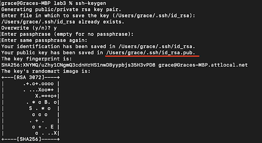
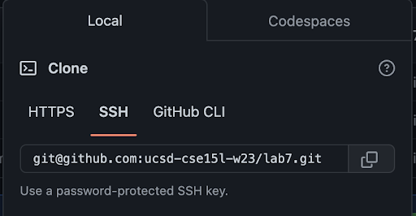
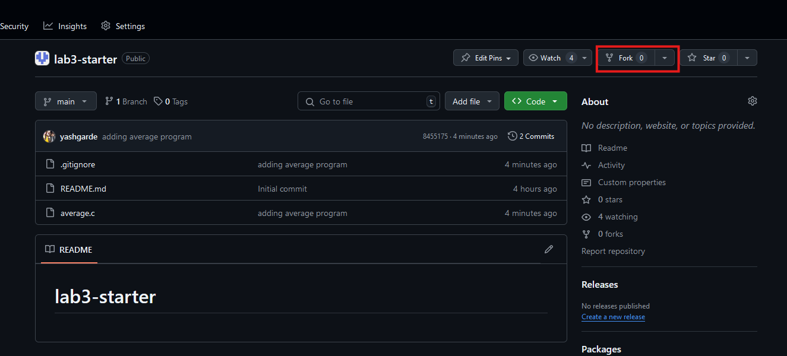

# Week 3 – VSCode and Your Local Machine

## Lab Goals
1. Set up SSH keys for `ieng6` and Github
2. Learn basic terminal shortcuts and editing in  `vim`
3. Learn how to manage repositories using `git` CLI

## Lab Tasks

### Part 1 – Visual Studio Code
Since the start of the course, we've been using Codespaces on Github as an environment to write and run our C code. This week, we're going to set up our own environment using Visual Studio Code on our local machine to write and run our code. This will give us more control over our environment and allow us to work on our code even when we're not connected to the internet.

(If you can't or don't want to use your own computer for this for any reason,
you can do the installation of VScode on one of the computers in the lab! You
can do all your work on the lab computers all quarter, no personal laptop setup
required.)

Go to the Visual Studio Code website
[https://code.visualstudio.com/](https://code.visualstudio.com/), and follow the
instructions to download and install it on your computer. There are versions for
all the major operating systems, like macOS (for Macs) and Windows (for PCs).

When it is installed, you should be able to open a familiar window that looks like this
(it might have different colors, or a different menu bar, depending on your
system and settings):

**Write down in notes**: Everyone should share a screenshot of VScode open –
help folks figure it out if it won't install. If someone gets stuck, take a
screenshot of the error message or point at which they are stuck so we can help
them figure it out later, and they can decide to keep trying (potentially with
the tutor helping) or move on.

**NOTE:** For the purposes of this lab we will be using VSCode primarily as an access point to the terminal
as it has a very similar interface to the Codespaces that we have been using thus far. VSCode is also a powerful text editor to write and develop code in but we will not be covering those capabilities in this lab.

**Next** if you're on Windows: install `git` for Windows, which comes with some
useful tools we need:

[Git for Windows](https://gitforwindows.org/)

<!-- (#Arunan - Should we include instructions for minGW on windows for gcc, gdb, etc.?)
(#Yash - I think we should. MinGW and then have them test the installation at the end of this section) -->

Once installed, use the steps in this post to set your default terminal to use
the newly-installed `git bash` in Visual Studio Code:

[Using Bash on Windows in VScode](https://stackoverflow.com/a/50527994)

(That's all the special instructions for Windows users). Then, to run commands,
open a terminal in VScode. (Ctrl or Command + \`, or use the Terminal → New
Terminal menu option). Try running some of the commands we learned in earlier
labs and lectures on this computer.

<!-- ADD MINGW INSTALLATION INSTRUCTIONS HERE -->

**Write down in notes**:

- What was the working directory of the terminal that opened in Visual Studio Code?
- What is your home directory on this computer?
- What files and folders are in the home directory?
- Where do you think files that download from your web browser go? Can you list
  them with `ls`? What's the absolute path to that folder?
- Do any commands work differently than you expect on this computer?
- Are you able to use `ssh` with your username and password
  from the terminal in VScode to log into `ieng6` and enter the course-specific account?

Take a few screenshots of what you tried, and discuss how this environment
differs from Codespaces.

### Part 2 - Setting up SSH Keys for Easy Access to `ieng6`

With the setup we've used so far this quarter, each time you log in to your
course-specific account, you have to type the password. This can get a bit tedious and luckily there is 
a cool and interesting way to avoid this while still staying secure using SSH keys.

- In your local terminal (the one you opened in VSCode), run `ssh-keygen`. This command will generate a pair of SSH keys for you, one public and one private.
- Keep pressing `<Enter>` until the program shows some text it calls the "randomart image".
  - Note the path where the public key is saved (underlined below). 
  - 
- Now, log into your remote course specific account on `ieng6` with `ssh`
  (using your password as usual)
- Run `mkdir .ssh` in the terminal
- Log out of your remote account by pressing `Ctrl-D` or typing `exit`.
- Now, we want to copy the public SSH key you created on your local machine onto your remote account;
specifically inside the `.ssh` directory you just created, in a file called
`authorized_keys`.
- Scroll up a bit to where you were creating the SSH key, find the line where it
says: `Your public key has been saved in: <path to your public SSH key>`, copy
the path. **Make sure you get the public key file, ending in `.pub`, here, not
the private file**.
<!-- Maybe we can have the students write the scp command themselves since they have seen it in Week 1 -->
- **Construct** a command that will perform the copying of the public key file from your local machine to the
  `.ssh` directory on your remote account with the appropriate name (HINT: you used this command in Week 1's lab). Work with your group members if you need help!
<!-- - From your local computer, run `scp <path to your public SSH key> user@ieng6.ucsd.edu:~/.ssh/authorized_keys` (make sure to fill in your actual username) -->
<!-- - Enter your password when prompted (this will be the last time you have to type it!) -->
- Try to log onto your remote account again, you shouldn’t be prompted for a
password anymore. If you are, ask for help and carefully review the steps above
with your group.

### Part 3 - Generating SSH Keys for GitHub
You can access and write data in repositories on GitHub.com using SSH. When you connect via SSH, you authenticate using a private key file on your local machine, which in our case will be the ieng6 machine.

- Login to ieng6 as usual (hopefully, without typing a password now!)
- Run the command `ssh-keygen`, and again press `<Enter>` until the command completes and shows the "randomart image"
  
Next, we want to add the public key to your Github account. This is like the step of copying the public key to authorized_keys on ieng6, but instead we're copying to Github.

- Display the SSH public key generated above using `cat <path of your ssh key .pub file>` and copy it to your clipboard; you can copy it by highlighting and right-clicking

- Open your Github account on the browser.
- In the upper right corner, click on your profile photo, then click *Settings*.
- In the *“Access”* section of the sidebar, click *SSH and GPG keys*.
- Click *New SSH key* or *Add SSH key* under the *“SSH keys”* section.
- Add a “Title” to your key (ex: *Aaron's* ieng6 machine).
- Select the *“Key Type”* to be an Authentication Key
- Copy your public key from the output of the cat command and paste it into the “Key” field
- Click *Add SSH key*.
- If prompted, confirm access to your account on Github.

Go back to the `ieng6` terminal and:

- Run the following command to add github.com as a recognized host (this avoids the scary yes/no prompt about accepting new connections the first time you connect)
  - `$ ssh-keyscan -t rsa github.com >> ~/.ssh/known_hosts`
  - `>>` means "append stdout of the command to file"
- Check your connection by running the following command:
  - `$ ssh -T git@github.com`
  - It will say something like "Hi *supercoolstudent1234*! You've successfully authenticated, but GitHub does not provide shell access."
  
Now we have an SSH key which can be used to authenticate to GitHub! In addition to using `https` clone URLs, we can now use `SSH` clone URLs that look like this:

Crucially, these will allow both cloning and pushing to the repository (as long as your account has access) from `ieng6`!

**Important**: For the rest of the lab, make sure to clone using the SSH clone URLs as described above!

### Part 4 - Working in Terminal

So far, we've been primarily using our terminal to compile our C code (with `gcc`)
and run our programs, but we've just scratched the service of what the terminal can do.
The terminal is the ultimate gateway into communicating with our computer, and today we're going
to dive more into the different ways we can use the terminal to make our lives easier.

#### 4.1 - Speeding Up

Now, you will explore various ways that you can speed up your work. Try all the steps below, and find out what works best (and what doesn’t work) for you!

1. **Using Bash History (up/down arrows)**

  When using the terminal to make and run our C programs, we are often times running the same 1-2 commands constantly. Isn't it annoying to type it out every time?

We can use the “up” and “down” arrows to go through the history of commands you have executed, it makes executing the same command much easier!
If you run the commands you care about, then log out and back in, they are still in the command history!

Executing the command you ran yesterday or last week would require a LOT of tapping of the up arrow.
We can take this one step further and *search* through our command history. You can use `Ctrl-R` to search your command history.
At the bash prompt, type `Ctrl-R` and then start typing part of a command – what shows up? After typing in your search term,
repeatedly inputting `Ctrl-R` will cycle through the different search results. Try experimenting with `Ctrl-R`!

**Write in your notes:** Paste a screenshot of using `Ctrl-R` to search through your command history. 

2. **Using Tab**
   
Sometimes our file names can get wordy, and it's frustrating to make a minor typo when compiling our program. Luckily, our terminal comes with a built-in autocomplete function!
Pressing the `TAB` key will either autocomplete the term your typing, or show you the available autocomplete options (if more than one exists)

**Task**: From your directory type `ls` and press `TAB` BEFORE submitting the command. What do you see? 

Pick any file/folder and type the first letter and press `TAB`. What changed?

You can use the `TAB` key to speed up typing commands in the command line in the following ways:
Start typing the first few letters of a command or path. Pressing `TAB` once will autofill the rest of the line up to the point where there are multiple potential possibilities. If you press `TAB` a second time, it will show you all of the possibilities for what it could autocomplete to.

If you want even *more* tricks to work even faster in terminal, check out this article:
https://www.redhat.com/sysadmin/shortcuts-command-line-navigation
<!-- Have you had a time where you mistyped one of the commands and had to backspace all the way back to fix the problem? There’s a better way!
Keyboard Shortcuts while editing commands
Ctrl-U deletes everything from the current cursor position to the beginning of the line
Ctrl-K deletes everything from the current cursor position to the end of the line
Ctrl-A goes back to the beginning of the line
Ctrl-E goes to the end of the line
Ctrl-W deletes the last word
Alt-Left/Alt-Right (Windows) or Option-Left/Option-Right (Mac) to move by word
Click the “left” or “right” arrow to go to the left/right end of any selection!
Quick Copy/Paste

Use these keyboard shortcuts to highlight text quicker:

Double click – selects an entire word
Triple click - selects an entire paragraph
Alt+Shift-Left/Alt+Shift-Right (Windows) or Option+Shift-Left/Option+Shift-Right (Mac) - select multiple words
On Mac:

Command-C to copy
Command-V to paste
On Windows:

Ctrl-C to copy
Ctrl-V to paste
Right click to paste in Windows terminal -->

#### 4.2 - VIM

`vim` is a text editor that runs entirely in the terminal. You also look a lot cooler controlling everything 
without needing a mouse.

There are a lot of online resources available for `vim`, but thankfully, the program itself comes with a
interactive tutorial (that's pretty neat!). We can access this tutorial with the `vimtutor` command from 
our terminal

**Task:** Open the `vimtutor` tutorial in your terminal and complete Chapters 1 & 2.
<!-- (#Arunan - refSpec said 30 minutes, how many chapters would that realistically be) -->

Once you have completed the first 2 chapters of `vimtutor`, you will now be using some of the commands that you learned to correct a bug in a C program that we have written for you.

**Task:**
- Fork this [repository](https://github.com/ucsd-cse29/lab3-starter) by click the down arrow next to the "Fork" option in the top right and clicking "Create a new fork" to create your own copy of our repository.
<!-- - Use this link to create your own copy of the starting repository -->

- If you aren't logged into `ieng6`, log in now. (password-free hopefully!)
- Clone your forked repository to your `ieng6` course-specific account using the SSH clone URL. The command would look like `git clone <SSH clone URL>`
- `cd` into your cloned repository directory.
- Compile (`gcc -o average average.c`) and run the `average.c` file. 
- Open the `average.c` file in `vim` and read through the program.
- Determine the bug in the program and correct it in `vim`. (Try doing it without introducing a new variable!) **Write in your notes:**  The keys/commands you are pressing/using while navigating `vim`
- Re-compile and re-run the program to ensure that it now outputs the correct value.

**Write in your notes:**
- The original output of the program.
- What do you think the program is supposed to do/output?
- What was the bug and how did you fix it?
- The output of the program after the bug has been fixed.

When you are done, discuss with a partner discuss what was comfortable and what was tricky about correcting the file.
Compare the commands you used with other members in your group and note the differences. 

Try reverting the bug fix and fixing it again using one of your group member's commands!

<!-- **Task:** Clone this Repo (#Arunan Link needed) and correct the bug in the given .c file using `vim`.
You can compile the program to ensure that it runs correctly on your machine. You may NOT
use an IDE or your mouse to complete this exercise.  (#Arunan - Is this good? IDK) -->

#### 4.3 - `git` CLI commands

So far you have been using the "Source Control" tab in your Github codespaces to commit and push your changes. Since we only have our terminal today, we will be learning how to use the `git` CLI to do the same thing.
- `git clone`

To retrieve a local copy of our git repository, we use the `git clone` command. `clone` takes a link from github (usually beginning with `https://github.com` or `git@github.com`). 

After we are done making changes to our local branch it's now time to push our changes to our remote branch (in this case github)
- `git status`

Let's first run `git status`, to see the status of our repository. `status` returns which files are untracked (new) modified (changed) and deleted. 

**Task:** After correcting the buggy C code, add the output of running the `git status` command in your terminal to your notes.

- `git add`

When we are done making changes to a file, we *"stage"* it to mark it as ready to be commited. Using the `git add` command with the path of the changed file(s) will stage each to be included in the next commit. Using `git add .` will stage all changed and/or new files in the current directory. 

**Task:** Use `git add` to stage our corrected C file. Add the output of `git status` to your notes.

- `git commit`

A **commit** is a package of associated changes. Running the `git commit` command will take all of our staged files, and package them into a single commit. With the `-m` flag, we can specify a message detailing the changes of the commit. Without `-m`, git opens a `vim` window to write the commit message.

**Task:** Use `git commit` to commit our staged changes. Use vim to write your commit message.

- `git push`

With our commit now made, we can use the `git push` command to upload our changes to our remote branch (github). If this is the first time you are using `git push`, git may ask you to set the name and email you want associated with your commits.

- `git log`

Git also keeps a log of all the changes. The `git log` command prints this log into our terminal. From this log we can see the date, author, and message associated with each commit. The **HEAD ->** marker points to the latest commit locally, while the **origin/** marker points to the latest commit on the remote. After running `git push`, both of these markers should be on the same line.

**Task:** After pushing your changes, add the output of `git log` to your notes.

### More Practice
**Potential TODO**
<!-- Add things here that students can do if they are done early -->

