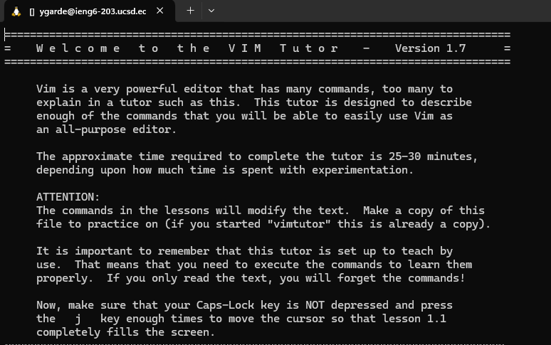
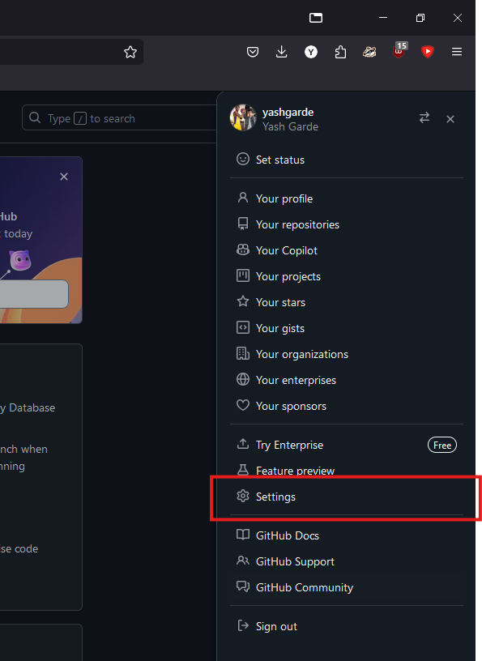
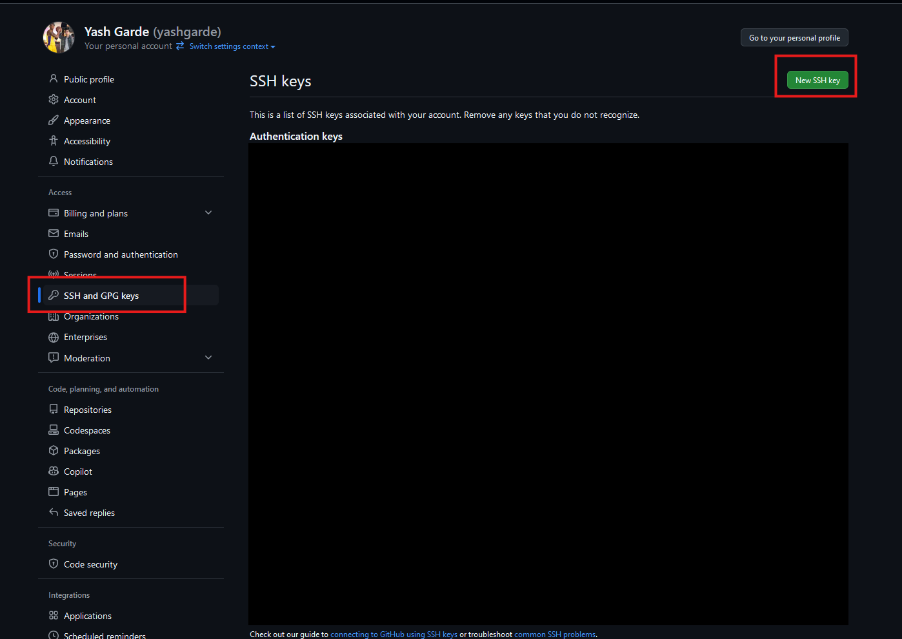
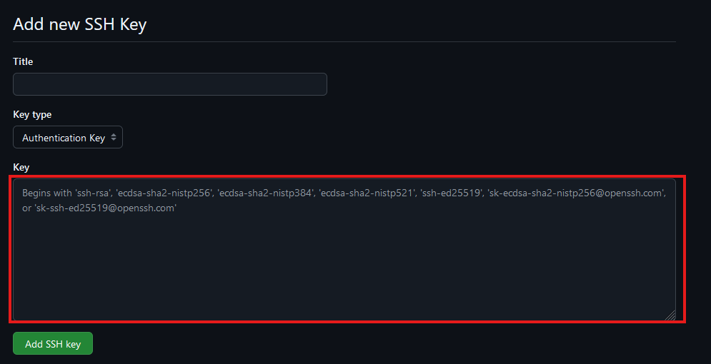
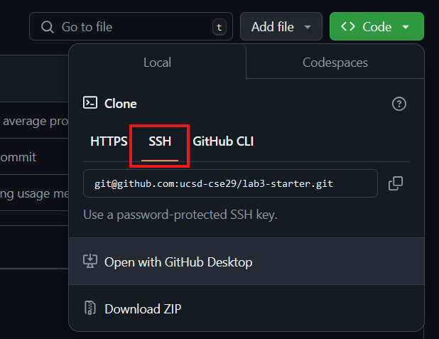

# Week 3 – Terminal Usage and Git


## Lab Goals

1. Set up SSH keys for `ieng6` and Github
2. Learn how to edit files on the terminal using  `vim`
3. Do all the steps for working on a PA entirely on a remote computer (`ieng6`)
4. Learn how to manage repositories using `git` CLI

## Lab Tasks

### Part 1 – Let's get a Terminal Setup

- [ ] If you're using Windows, install [Git for Windows](https://gitforwindows.org/) using all the default/recommended settings as suggested by the installation wizard. Mac users have a pre-installed terminal application.
- [ ] Open the Git Bash terminal application (Windows) or Terminal (Mac) and try some commands from [Lab 1](https://ucsd-cse29.github.io/fa24/week1/index.html#navigation-commands)
- [ ] Try to `ls` your `Desktop` directory. Do those files look familiar?
- [ ] Try to `ssh` into `ieng6` with your username and password (just like you did in [Lab 1](https://ucsd-cse29.github.io/fa24/week1/index.html#logging-into-ieng6))
- [ ] Help each other if anyone has issues installing or figuring out the terminal.

**Discuss and write in notes**:

- What was the working directory of the terminal when you launched it?
- What is your home directory on this computer?
- What files and folders are in the home directory?
- Where do you think files that download from your web browser go? Can you list
  them with `ls`? What's the absolute path to that folder?
- Do any commands work differently than you expect on this computer?
- Are you able to use `ssh` with your username and password
  from your local terminal to log into `ieng6` and enter the course-specific account?

Take a few screenshots of what you found particularly interesting, and discuss how this environment
differs from the terminal you used on Codespaces.


<!-- (#Arunan - Should we include instructions for minGW on windows for gcc, gdb, etc.?)
(#Yash - I think we should. MinGW and then have them test the installation at the end of this section) -->

<!-- ADD MINGW INSTALLATION INSTRUCTIONS HERE -->


### Part 2 - Setting up SSH Keys for Easy Access to `ieng6`

With the setup we've used so far this quarter, each time you log in to your
course-specific account, you have to type the password. This can get a bit tedious and luckily there is 
a cool and interesting way to avoid this while still staying secure using SSH keys.

We've labelled each step with whether it should run on **[Y]** our computer or **[i]** eng6. Make sure you follow the instructions carefully!

1. **[Y]** In your local terminal (the one you opened in VSCode), run `ssh-keygen`. This command will generate a pair of SSH keys for you, one public and one private.
2. **[Y]** Keep pressing `<Enter>` until the program shows some text it calls the "randomart image".
    - Note the path where the public key is saved (underlined below). 
    - 
3. **[Y]**/**[I]** Now, log into your remote course specific account on `ieng6` with `ssh`
  (using your password as usual)
**DO NOT** run the `cs29fa24` command to prepare your course-specific environment!

4. **[I]** Run `mkdir .ssh` in the terminal
5. **[I]**/**[Y]** Log out of your remote account by pressing `Ctrl-D` or typing `exit`.
6. **[Y]** Now, we want to copy the public SSH key you created on your local machine onto your remote account;
specifically inside the `.ssh` directory you just created, into a file called
`authorized_keys`.
Scroll up in your terminal to where you were creating the SSH key, find the line where it
says: `Your public key has been saved in: <path to your public SSH key>`, copy
the path. **Make sure you get the public key file, ending in `.pub`, here, not
the private file**.
<!-- Maybe we can have the students write the scp command themselves since they have seen it in Week 1 -->
7. **[Y]** **Think about** a command that will perform the copying of the public key file from your local machine to the
  `.ssh` directory on your remote account with the appropriate name (HINT: you [used this command in Week 1's lab](https://ucsd-cse29.github.io/fa24/week1/index.html#making-an-edit)). Work with your group members if you need help!
<details>
  <summary>If you're really stuck, click here to see the answer</summary>
  From your local computer, run 

  ```
scp PATH_TO_YOUR_PUBLIC_SSH_KEY USER@ieng6.ucsd.edu:~/.ssh/authorized_keys
  ```

  Make sure to replace `USER` with your UCSD username and `PATH...` with the appropriate path
</details>
<br>
<!-- - From your local computer, run `scp <path to your public SSH key> user@ieng6.ucsd.edu:~/.ssh/authorized_keys` (make sure to fill in your actual username) -->
<!-- - Enter your password when prompted (this will be the last time you have to type it!) -->

8. **[Y]**/**[I]** Try to log onto your remote account again, **you shouldn’t be prompted for a
password anymore.** If you are, ask for help and carefully review the steps above
with your group. To review:
    - You should have a directory called `.ssh` on *your* computer in your home directory.
    - That folder should have a key file created by `ssh-keygen` and a corresponding `.pub` version of the file.
    - You should have a directory called `.ssh` on `ieng6` (that you created with `mkdir`) in your home directory.
    - The `.pub` file from your computer should be copied to the `.ssh/authorized_keys` file on `ieng6`

**Add to your notes:** A screenshot of you logging into your `ieng6` account without a password prompt.

### Part 3 - Working in Terminal

So far, we've been primarily using our terminal to compile our C code (with `gcc`)
and run our programs, but we've just scratched the service of what the terminal can do.
The terminal is the ultimate gateway into communicating with our computer, and today we're going
to dive more into the different ways we can use the terminal to make our lives easier.

#### 3.1 - VIM

`vim` is a text editor that runs entirely in the terminal. For better or worse, many times developers find themselves with only terminal access to a remote computer, and need to do some programming – that is, editing source code files. A terminal-based editor makes this possible. (As a side effect you can look like hacker from a movie controlling everything 
without needing a mouse.)

There are a lot of online resources available for `vim`, but thankfully, the program itself comes with a
interactive tutorial (that's pretty neat!). We can access this tutorial with the `vimtutor` command from 
our terminal

**Task:** Open the `vimtutor` tutorial in your terminal and complete Chapters 1 & 2.

<!-- (#Arunan - refSpec said 30 minutes, how many chapters would that realistically be) -->

Once you have completed the first 2 chapters of `vimtutor`, you will now be using some of the commands that you learned to correct a bug in a C program that we have written for you.

**Task:**

1. **[Y]**/**[I]** If you aren't logged into `ieng6`, log in now. (password-free hopefully!)
2. **[I]** Download our buggy C program using `curl`. The command would look like 

`curl https://raw.githubusercontent.com/ucsd-cse29/lab3-starter/refs/heads/main/average.c -o average.c`

3. **[I]** Compile and run the `average.c` file.
4. **[I]** Open the `average.c` file in `vim` and read through the program.
5. **[I]** Determine the bug in the program and correct it in `vim`. (Try doing it without introducing a new variable!) 

**Write in your notes:**  The keys/commands you are pressing/using while navigating `vim`

6. **[I]** Re-compile and re-run the program to ensure that it now outputs the correct value.


**Write in your notes:**
- The original output of the program.
- What do you think the program is supposed to do/output?
- What was the bug and how did you fix it?
- The output of the program after the bug has been fixed.

When you are done, discuss with a partner discuss what was comfortable and what was tricky about correcting the file.
Compare the commands you used with other members in your group and note the differences. 


#### 3.2 - VIM Telephone

Next, we will see how different members of your group approached fixing the bug in the provided C code. You will be running your group members' `vim` keystrokes to see the differences in how each of you navigated the `vim` editor.

**Task:** 

2. **[I]** Redownload our C file using a similar `curl` to the previous section. 
`curl https://raw.githubusercontent.com/ucsd-cse29/lab3-starter/refs/heads/main/average.c -o average2.c`. 
3. **[I]** Now, run the commands that another member of your group used to correct the `average.c` file. You should find the commands
in your shared Google Doc.
4. **Write in your notes:** What were some of the key differences you noticed between your keystrokes and your group members?

### Part 4 - Github with `ieng6`

With the bug fixed, we now want to push our changes to our Github repository. Before we can do that though, we need to be able to perform actions against our Github repository from `ieng6`. This is where SSH keys come in handy once again!

#### 4.1 - Setting up SSH Keys for Github


1. **[Y]/[I]** Login to `ieng6` as usual (hopefully, without typing a password now!)
2. **[I]** Run the command `ssh-keygen`, and again press `<Enter>` until the command completes and shows the "randomart image". Just like before, this will put a key file and a `.pub` version of it into the `.ssh` directory – this time on `ieng6`!
  
Next, we want to add the public key to your Github account. This is like the step of copying the public key to authorized_keys on ieng6, but instead we're copying to Github.

3. **[I]** Display the SSH public key generated above using `cat <path of your ssh key .pub file>` and copy it to your clipboard; you can copy it by highlighting and right-clicking

4. Open your Github account on the browser.
5. In the upper right corner, click on your profile photo, then click *Settings*.

6. In the *“Access”* section of the sidebar, click *SSH and GPG keys*.
7. Click *New SSH key* or *Add SSH key* under the *“SSH keys”* section.

8. Add a “Title” to your key (ex: *Aaron's* ieng6 machine).
9.  Select the *“Key Type”* to be an Authentication Key
10. Copy your public key from the output of the cat command and paste it into the “Key” field

11. Click *Add SSH key*.
12. If prompted, confirm access to your account on Github.

Go back to the `ieng6` terminal and:

13. **[I]** Run the following command to add github.com as a recognized host (this avoids the scary yes/no prompt about accepting new connections the first time you connect)
    - `$ ssh-keyscan -t rsa github.com >> ~/.ssh/known_hosts`
    - `>>` means "append stdout of the command to file"
14. **[I]** Check your connection by running the following command:
    - `$ ssh -T git@github.com`
    - It will say something like "Hi *supercoolstudent1234*! You've successfully authenticated, but GitHub does not provide shell access."
  
Now we have an SSH key which can be used to authenticate to GitHub! In addition to using `https` clone URLs, we can now use `SSH` clone URLs that look like this:


Crucially, these will allow both cloning and pushing to the repository (as long as your account has access) from `ieng6`!

#### 4.2 - `git` CLI commands

So far you have been using the "Source Control" tab in your Github codespaces to commit and push your changes. Since we only have our terminal today, we will be learning how to use the `git` CLI to do the same thing.

- **Forking** a repository

A *fork* of a repository is a personal copy of the repository that you can make changes to without affecting the original repository. To fork a repository, click the "Fork" button in the top right corner of the repository page.

**Task:** Create a fork of the Lab 3 starter repository [here](https://github.com/ucsd-cse29/lab3-starter).

<br>

- **Cloning** with `git clone`

To retrieve a local copy of our git repository, we use the `git clone` command. `clone` takes a link from github (usually beginning with `https://github.com` or `git@github.com`). 

**Task:** Use the `SSH` clone URL to clone your forked repository to your `ieng6` account into another new directory. Fix the bug that you fixed earlier in the `average.c` file again and then proceed!




After we are done making changes to our local branch it's now time to push our changes to our remote branch (in this case github)

<br>

- **Getting the status** with `git status`

Let's first run `git status`, to see the status of our repository. `status` returns which files are untracked (new) modified (changed) and deleted. 

**Task:** After correcting the buggy C code, add the output of running the `git status` command in your terminal to your notes.
<br>

- **Staging** file with `git add`

When we are done making changes to a file, we *"stage"* it to mark it as ready to be commited. Using the `git add` command with the path of the changed file(s) will stage each to be included in the next commit. Using `git add .` will stage all changed and/or new files in the current directory. 

**Task:** Use `git add` to stage our corrected C file. Compare the output of `git status` to the output written in your notes.
<br>


- **Committing** with `git commit`

A *commit* is a package of associated changes. Running the `git commit` command will take all of our staged files, and package them into a single commit. With the `-m` flag, we can specify a message detailing the changes of the commit. Without `-m`, git opens a `vim` window to write the commit message.

**Task:** Use `git commit` to commit our staged changes. Use vim to write your commit message.
<br>

- **Pushing** to the remote repository with `git push`

With our commit now made, we can use the `git push` command to upload our changes to our remote branch (github). If this is the first time you are using `git push`, git may ask you to set the name and email you want associated with your commits.
<br>

- **Viewing the log** with `git log`

Git also keeps a log of all the changes. The `git log` command prints this log into our terminal. From this log we can see the date, author, and message associated with each commit. The **HEAD ->** marker points to the latest commit locally, while the **origin/** marker points to the latest commit on the remote. After running `git push`, both of these markers should be on the same line.

**Task:** After pushing your changes, add the output of `git log` to your notes.

<!-- Add things here that students can do if they are done early -->


