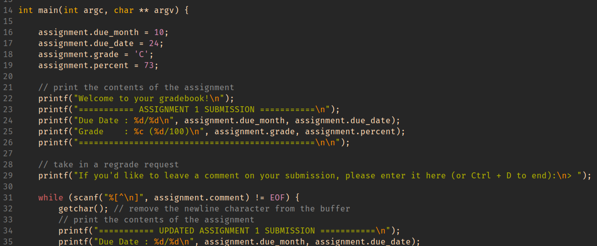

# Change your Grade with Buffer Overflows

The relevant file for this part of the lab is found within the `gradebook` directory in the `lab7-starter` repository you cloned at the start of lab.

In this directory you will find a single executable file called `gradebook`. Running this program will display your (fictional) assignment grade for Assignment 1 and ask whether you would like to leave a comment for a regrade:
```
./gradebook
Welcome to your gradebook!
=========== ASSIGNMENT 1 SUBMISSION ===========
Due Date : 10/24
Grade    : D
Percent  : 65
===============================================

If you'd like to leave a comment on your submission, please enter it here (or Ctrl + D to end):
> 
```

After entering a comment, you will see an updated assignment entry printed out with your comment and the option to edit the comment:

```
If you'd like to leave a comment on your submission, please enter it here (or Ctrl + D to end):
> please regrade my submission
=========== UPDATED ASSIGNMENT 1 SUBMISSION ===========
Due Date : 10/24
Grade    : D
Percent  : 65
Comment  : please regrade my submission
=======================================================

If you'd like to edit your comment, please type your new comment here (or Ctrl + D to end):
> 
```

<!-- Want to rephrase this a little bit, gives a bit too much away right now i feel -->
A confidential source has informed you of a **vulnerability** in this gradebook that allows you to change your grade for the assignment if you provide an appropriate comment. This source has also given you the following screenshot of the source code to help you:

#### `gradebook.c` Source Code:


**TASK:**
1. Using the information above and tools you have learned about in CSE 29, determine how you would **change your grade in Assignment 1 to an A**.
2. Once you have successfully changed your grade to an A, **change your percent to reflect your new grade as well**, a 95% sounds about right!

**In your notes:** Describe how you changed your letter grade and percentage for the assignment. What properties of the program did you exploit for this? Compare your approach to that of your group members and discuss any differences in your approaches.
