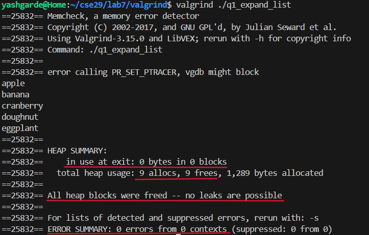

# Addressing your Memory Errors

The relevant files for this part of the lab are found within the `valgrind` directory in the `lab7-starter` repository you cloned earlier.

In this directory, you will find a `Makefile`, `jstr.c` and `arraylist.c` which contain the implementations of the `String` and `List` structs you have seen in lecture. In addition to these files, there are 6 additional C files labeled `q1-q6`. 

Each of these `q` files implements function(s) on the `String` and `List` structs but with one or more memory related errors in them. Your task is to use `valgrind` to determine these errors and fix them. The files are numbered in increasing order of difficulty, so it is recommended to start with `q1_expand_list.c` and work your way up.

**TASKS:**
1. Open `jstr.c` and `arraylist.c` and familiarize yourself with the implementations of the `String` and `List` structs.
2. Run the `make` command to compile all the buggy C files. You should now have 6 executables in your directory. (Check this by using `ls`).
   
3. For each program (starting with `q1`), run it both with and without `valgrind` to see what happens. Use the program output (whether it crashed or not) and `valgrind` to determine where the error may be and edit the C file to fix it. Remember to use `--leak-check=full` to get more detailed information about memory leaks.

    **NOTE:** The names of the files as well as the function names within the files are hints for where the error may be.

    **NOTE:** All the changes should be in the `buggy_` functions found in each file. The `main` function should not need to be modified.

4. Once you have fixed the error(s) in a file, run the program with `valgrind` again to ensure that there are no memory leaks or other memory-related errors. Your `valgrind` output should look like:

All heap memory should be freed and there should be no errors reported in the `ERROR SUMMARY`.
5. When you determine the bug in each of the files, describe the error you found and how you fixed it **in your notes**. Provide a screenshot of the `valgrind` output for the fixed program.